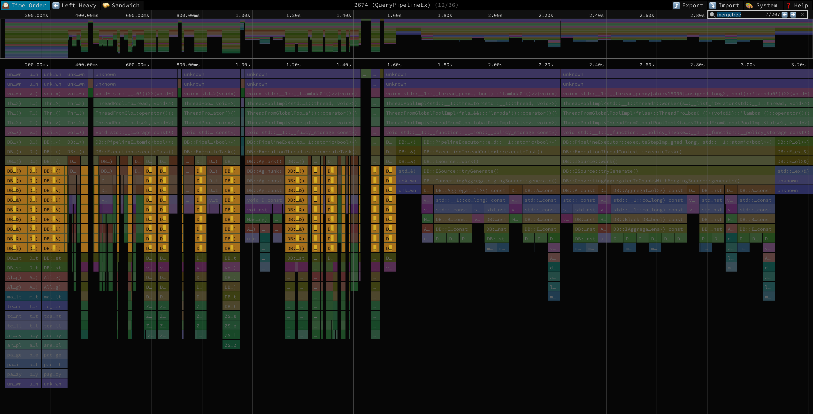
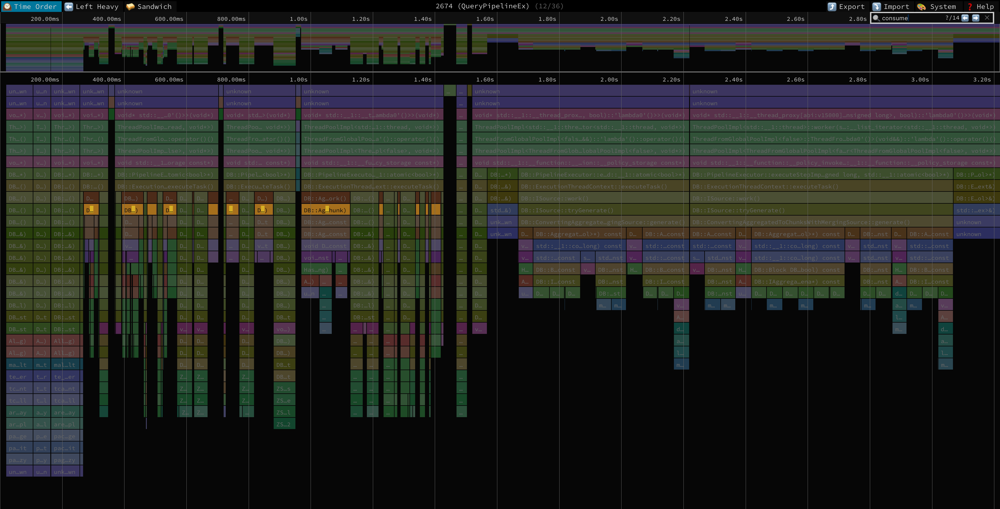
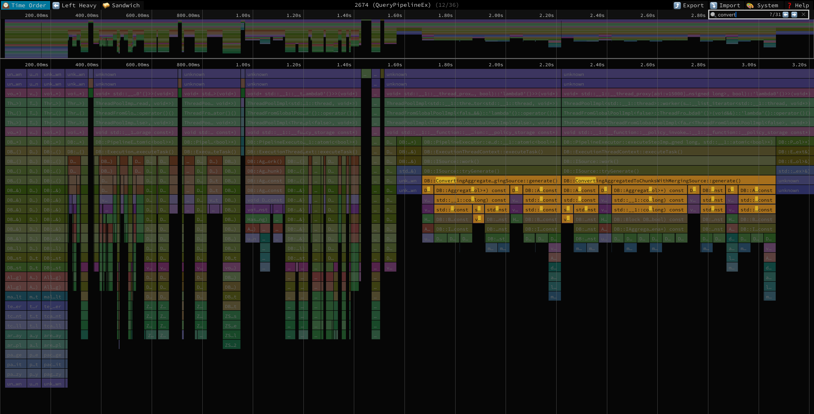

# ch2speedscope

This utility transforms [`ClickHouse`](https://github.com/ClickHouse/ClickHouse) profiling facilities output into the [`speedscope`](https://github.com/jlfwong/speedscope) profile format.

The advantage of `speedscope` comparing to the traditional `FlameGraph`-s is the "Time Order" visualisation mode
that presents call stacks ordered by the time they appear in the profile instead of just a static picture when all the same stacks merged together.
This way you could see what the process was busy with in different points in time.

## `system.trace_log`

__*TL;DR*__ Data in `trace_log` collected by the sampling profiler.
To create an event-based (event is "function foo started executing at the moment `t0` and finished at the moment `t1`")
profile we transform each entry `(timestamp, trace)` (there are more fields, but they're not important now) into an event

`([timestamp; timestamp + sampling_period], trace)`

, where

`sampling_period = min(query_profiler_cpu_time_period_ns, query_profiler_real_time_period_ns)`.

I.e. we assume that each function started executing at the moment it was observed by the sampling profiler and finished in `sampling_period` nanoseconds.

---

[`trace_log`](https://clickhouse.com/docs/en/operations/system-tables/trace_log) documentation.

Essentially all you need to do is set `query_profiler_cpu_time_period_ns` and/or `query_profiler_real_time_period_ns` to a reasonable values.
Please also set `log_query_threads = 1` - this is needed to display thread names together with thread id-s in output profile.

---

To have a taste of what you gonna get take a look at this profile: [trace_log_aggregation_profile](./examples/trace_log_aggregation_profile.json).

Here you can see reading transforms execution alternated by pre-aggregation:

And merging happening after this:

## `system.opentelemetry_span_log`

[`opentelemetry_span_log`](https://clickhouse.com/docs/en/operations/system-tables/opentelemetry_span_log) documentation.

TODO: implement support.
